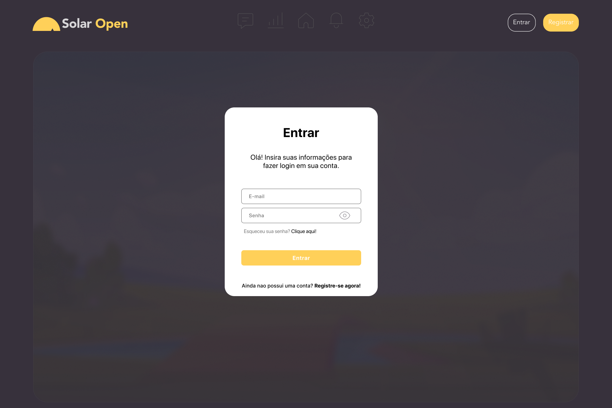
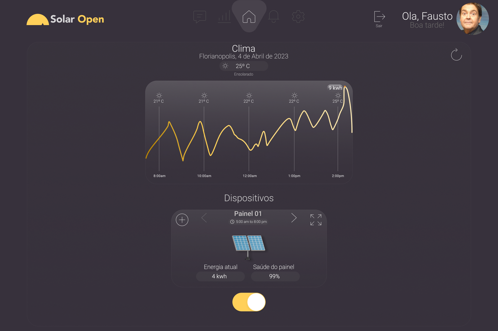
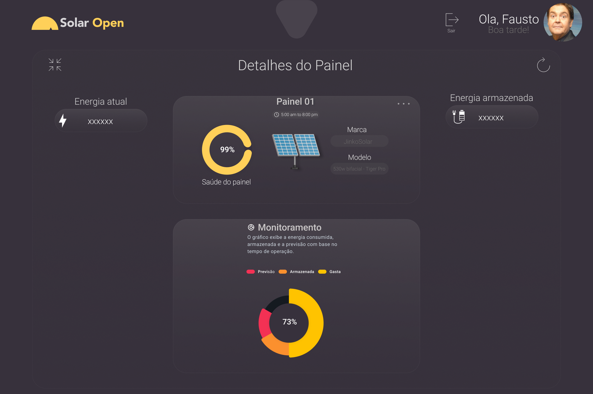

Um monitoramento de energia solar simples e eficiente no qual cada pessoa pode fazer seu monitoramento e controle de forma simplificada na palma da mão.

### Funcionalidades

1. **Monitoramento da produção de energia solar:** O aplicativo se conecta ao sistema de painéis solares instalado em minha casa ou empresa e mostra a quantidade de energia produzida em tempo real. Isso me permite monitorar o desempenho do sistema solar e saber quando a produção de energia está abaixo do esperado.

2. **Acompanhamento do consumo de energia:** O aplicativo se conecta ao medidor de energia elétrica da minha casa ou empresa e mostra a quantidade de energia consumida em tempo real. Isso me permite acompanhar o consumo de energia e saber o quanto estou gastando em eletricidade.

3. **Exibição de dados históricos:** O aplicativo mostra o histórico de produção e consumo de energia ao longo do tempo em gráficos e tabelas. Isso me permite comparar o desempenho do meu sistema solar em diferentes momentos e saber se houve mudanças no consumo de energia.

4. **Alertas de desempenho:** O aplicativo pode ser configurado para enviar alertas quando houver quedas na produção de energia ou consumo excessivo de eletricidade. Isso me permite tomar medidas para corrigir problemas ou ajustar o sistema solar para melhorar o desempenho.

5. **Integração com sistemas de gerenciamento de energia existentes:** O aplicativo pode se integrar com outros sistemas de gerenciamento de energia em minha casa ou empresa, como termostatos inteligentes e sistemas de iluminação automatizados. Isso me dá uma visão abrangente de como estou usando a energia e permite fazer ajustes para melhorar a eficiência energética.

6. **Monitoramento da bateria de armazenamento de energia:** Se meu sistema solar incluir uma bateria de armazenamento de energia, o aplicativo mostra o nível de carga da bateria em tempo real e me alerta quando estiver baixo. Isso me permite aproveitar ao máximo a energia produzida pelo sistema solar e evitar desperdícios.

### Tecnologias Utilizadas

Para o desenvolvimento do Solar-Open, utilizamos as seguintes tecnologias:

#### 🌐 App Web
- **Backend: Python**
    - Linguagem de programação poderosa e versátil, escolhida por sua ampla gama de bibliotecas e frameworks, facilitando o desenvolvimento do backend do aplicativo.

- **Frontend: Flask**
    - Framework leve e flexível para criação de aplicativos web em Python, escolhido por sua simplicidade e facilidade de uso, permitindo a construção da interface do usuário de forma eficiente.

- **Banco de Dados: PostgreSQL**
    - Sistema de gerenciamento de banco de dados relacional robusto e confiável, escolhido por sua escalabilidade, segurança e suporte a consultas complexas.

- **APIs: Integração com APIs de sistemas de painéis solares e medidores de energia**
    - Integração com APIs de terceiros para acessar os dados dos sistemas de painéis solares e medidores de energia, permitindo o monitoramento em tempo real da produção e consumo de energia.

- **Autenticação e Autorização: JSON Web Tokens (JWT)**
    - Mecanismo de autenticação baseado em tokens seguro e eficiente, escolhido para fornecer autenticação e autorização no aplicativo, garantindo que apenas usuários autorizados tenham acesso às funcionalidades.

- **Gráficos e Visualizações: Matplotlib**
    - Biblioteca de visualização de dados em Python, escolhida para criar gráficos e tabelas que exibem o histórico de produção e consumo de energia de forma clara e intuitiva.

- **Envio de Alertas: Firebase Cloud Messaging (FCM)**
    - Serviço de mensagens em tempo real fornecido pelo Firebase, escolhido para enviar alertas aos usuários em caso de quedas na produção de energia ou consumo excessivo, permitindo uma resposta rápida aos problemas.

- **Integração com APIs de Terceiros: Previsão do tempo para otimização da energia solar**
    - Integração com serviços de previsão do tempo por meio de APIs de terceiros, permitindo a otimização do uso da energia solar com base nas condições climáticas previstas.

Essas tecnologias foram selecionadas com base em sua eficiência, facilidade de uso e suporte ativo pela comunidade de desenvolvedores, garantindo um desenvolvimento sólido e confiável para o Solar-Open.

### Design e Interface de usuário

- [LANDPAGE](https://github.com/ferrariz1n/Solar-Open/tree/main/landpage-solaropen)
- [FIGMA](https://www.figma.com/file/KkfqRYg4qZbWhJrMlsQsxz/SolarOpenApp?type=design&node-id=0%3A1&t=9kGWvlB0hZiTA41J-1)

| Login                                      | Home                                      | Detalhes do painél                                      |
| ------------------------------------------- | ------------------------------------------- | ------------------------------------------- |
|  |  |  |

