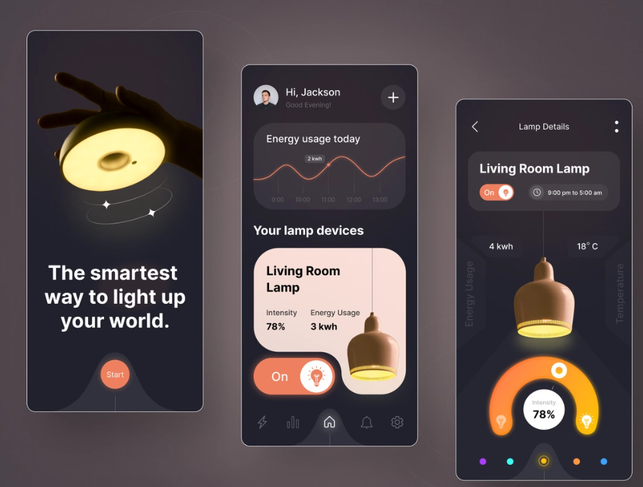

# Solar-Open

Um monitoramento de energia solar simples e eficiente no qual cada pessoa possa fazer seu monitoramento e controle de forma simplificada na palma da mão.

## Fase 1: Definição de funcionalidades

Nesta fase, serão definidos os recursos que o aplicativo deve ter. Algumas opções podem incluir:

1. **Monitoramento da produção de energia solar:** O aplicativo pode se conectar ao sistema de painéis solares instalado na casa ou empresa do usuário e mostrar a quantidade de energia produzida em tempo real. Isso permite que o usuário monitore o desempenho do sistema solar e saiba quando a produção de energia está abaixo do esperado.

2. **Acompanhamento do consumo de energia:** O aplicativo pode se conectar ao medidor de energia elétrica da casa ou empresa do usuário e mostrar a quantidade de energia consumida em tempo real. Isso permite que o usuário acompanhe o consumo de energia e saiba quanto está gastando em eletricidade.

3. **Exibição de dados históricos:** O aplicativo pode mostrar o histórico de produção e consumo de energia ao longo do tempo em gráficos e tabelas. Isso permite que o usuário compare o desempenho do sistema solar em diferentes momentos e saiba se houve mudanças no consumo de energia da casa ou empresa.

4. **Alertas de desempenho:** O aplicativo pode ser configurado para enviar alertas ao usuário em caso de quedas na produção de energia ou consumo excessivo de eletricidade. Isso permite que o usuário tome medidas para corrigir problemas ou fazer ajustes no sistema solar para melhorar o desempenho.

5. **Integração com sistemas de gerenciamento de energia existentes:** O aplicativo pode se integrar com sistemas de gerenciamento de energia existentes na casa ou empresa do usuário, como termostatos inteligentes e sistemas de iluminação automatizados. Isso permite que o usuário tenha uma visão abrangente de como está usando a energia e faça ajustes para melhorar a eficiência energética.

6. **Monitoramento da bateria de armazenamento de energia:** Se o sistema solar incluir uma bateria de armazenamento de energia, o aplicativo pode mostrar o nível de carga da bateria em tempo real e alertar o usuário quando a carga estiver baixa. Isso permite que o usuário aproveite ao máximo a energia produzida pelo sistema solar e evite desperdícios.

## Fase 2: Definir as plataformas

Em quais plataformas o aplicativo será disponibilizado? É importante decidir se o aplicativo será disponibilizado em dispositivos móveis (iOS e Android) ou se também será acessível em um site.

- [🤖 Android](./readme_infos/android.md)
- [🍎 iOS](./readme_infos/ios.md)
- [🌐 Web](./readme_infos/web.md)
- [🖥️ Desktop](./readme_infos/desktop.md)
- [⚔️ Cross-Plataform](./readme_infos/cross_plataform.md)

## Fase 3: Definir o design e a interface de usuário

Definir o design e a interface de usuário do projeto é criar a aparência visual e a experiência de uso do aplicativo para que ele seja fácil e intuitivo para os usuários.

1. **Design simples e intuitivo:** O design do app deve ser simples e fácil de usar, com uma interface intuitiva que permita aos usuários acessar facilmente as informações de que precisam.

2. **Escolha das cores:**  A escolha das cores deve ser cuidadosa, já que as cores influenciam muito na experiência do usuário. Uma paleta de cores relacionadas à natureza e à energia solar pode ser uma boa opção.

3. **Uso de ícones e ilustrações:** O uso de ícones e ilustrações pode ajudar a tornar o app mais visual e fácil de entender para os usuários.

4. **Organização dos dados:** As informações devem ser organizadas de forma clara e lógica, de modo que os usuários possam facilmente entender o que estão vendo e como usar as informações.

5. **Personalização:** O app pode incluir recursos de personalização, permitindo que os usuários personalizem a interface de acordo com suas preferências e necessidades específicas.

6. **Acessibilidade:** A interface do app deve ser acessível a todos os usuários, independentemente de suas habilidades visuais ou físicas.

	### [Figma](https://www.figma.com/file/KkfqRYg4qZbWhJrMlsQsxz/SolarOpenApp?node-id=0-1&t=7Af39fXuEug4Ndjx-0)

    Você pode ver uma ideia de design para o aplicativo Solar-Open abaixo:

    

## Fase 4: Desenvolvimento

É aqui que os desenvolvedores transformam o design e as especificações em um aplicativo real e funcional. As etapas específicas envolvidas na etapa de desenvolvimento podem variar dependendo da plataforma de desenvolvimento escolhida, mas em geral, as etapas incluem:

1. **Configuração do ambiente de desenvolvimento:** Antes de iniciar o desenvolvimento, é importante configurar o ambiente de desenvolvimento com as ferramentas e tecnologias necessárias. Isso pode incluir a instalação de um IDE (Integrated Development Environment), o download de bibliotecas de terceiros e a configuração de um servidor de desenvolvimento.

2. **Desenvolvimento do Front-end:**  O front-end é responsável pelo design e pela interface do usuário do aplicativo. Os desenvolvedores usarão linguagens de programação e ferramentas específicas para criar uma interface gráfica de usuário (GUI) atraente e fácil de usar. Isso pode incluir a criação de telas, botões, gráficos, tabelas e outras ferramentas de interface do usuário.

3. **Desenvolvimento do Back-end:** O back-end é responsável pelo armazenamento e processamento de dados do aplicativo. Os desenvolvedores usarão linguagens de programação e ferramentas específicas para criar um servidor que permita a coleta, armazenamento e acesso aos dados de energia solar. Isso pode incluir a criação de um banco de dados, a configuração de APIs e o desenvolvimento de algoritmos de processamento de dados.

4. **Integração de hardware:** Se o aplicativo de monitoramento de energia solar precisar integrar hardware específico, como sensores de energia solar, conversores DC-AC, inversores, entre outros, é importante que os desenvolvedores garantam que o aplicativo possa se comunicar com esses dispositivos.

5. **Testes:** Durante o desenvolvimento, é importante testar o aplicativo regularmente para garantir que ele funcione corretamente e atenda às especificações. Isso pode incluir testes de unidade, testes de integração e testes de aceitação.

6. **Refinamento:** Ao longo do processo de desenvolvimento, os desenvolvedores podem precisar fazer ajustes e refinamentos no aplicativo com base nos testes e no feedback do usuário. Isso pode incluir a adição de recursos adicionais, melhorias na interface do usuário e correção de bugs.

## Fase 5: Testes

Nessa fase, o app é testado para verificar se ele está funcionando conforme o esperado. Testes de usabilidade, testes de desempenho e testes de segurança são alguns dos tipos de testes que podem ser realizados.

## Fase 6: Lançamento

Nessa fase, o app é preparado para o lançamento e é disponibilizado nas lojas de aplicativos para download. É importante realizar uma campanha de marketing para divulgar o app e atrair usuários.

## Fase 7: Manutenção

Nessa fase, o app é atualizado regularmente para corrigir erros e bugs, adicionar novos recursos e garantir que o app esteja funcionando corretamente em novas versões de sistemas operacionais.

## Fase 8: Marketing e suporte

Depois de lançado, é importante promover o aplicativo e oferecer suporte aos usuários para garantir que eles possam utilizá-lo corretamente e aproveitar ao máximo suas funcionalidades.

## Conclusão

 

- [ ] Fase 1
- [ ] Fase 2
- [ ] Fase 3
- [ ] Fase 4
- [ ] Fase 5
- [ ] Fase 6
- [ ] Fase 7
- [ ] Fase 8
